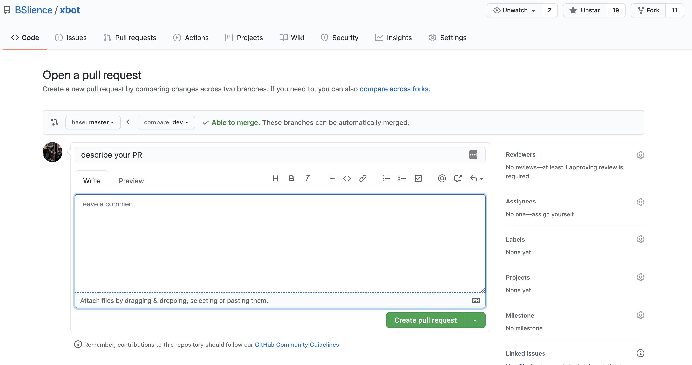

[English](CONTRIBUTING.en_US.md)

## 如何向 XBot 贡献代码

#### 1. Forking XBot 仓库

找到 XBot 首页 然后点击 "Fork"。"Fork" 仓库会为您创建本项目的副本，您可以编辑该副本并使用该副本对原始项目提交更改。


完成 "Fork" 后，XBot 仓库的副本将出现在您的 GitHub 仓库列表中。

#### 2. 将您仓库中的 XBot 项目副本克隆到本地

要更改 XBot 项目的副本，请在本地计算机上克隆仓库，在终端中运行以下命令：

```
git clone https://github.com/your_github_username/xbot.git
```

点击克隆或下载按钮后，可以找到仓库的链接，如下图所示：


注意: 以上步骤假设您在本地计算机上已经安装了 git。 如果没有，请查看[官方指南](https://git-scm.com/book/en/v2/Getting-Started-Installing-Git )进行安装。

#### 3. Update your Forked Repository

在对克隆的仓库进行任何更改之前，请确保您具有原始 XBot 仓库的最新版本。为此，请在终端中运行以下命令：

```
cd xbot
git remote add upstream https://github.com/BSlience/xbot.git
git pull upstream dev
```

以上命令将 XBot 本地副本更新为 develop 分支的最新版本。

#### 4. 开始贡献代码

此时，您可以开始对项目的本地文件进行修改。

您可以创建一个新分支，其中将包含您的贡献的实现。请运行以下代码新建分支：

```
git checkout -b name-of-your-new-branch
```

#### 5. 将更改推送到您 "Fork" 的 XBot 项目副本中

对本地文件中的更改感到满意后，将其推送到您 "Fork" 的 XBot 项目副本仓库中。为此，请运行以下命令：

```
git add .
git commit -m ‘fixed a bug’
git push origin name-of-your-new-branch
```

这将在您 "Fork" 的 XBot 副本仓库上创建一个新分支，现在您可以为您做出的更改提交 Pull Request！
 
#### 6. 在 XBot 原始项目中提交 Pull Request

进入您 "Fork" 的 XBot 项目副本 Github 主页，点击 _Compare & pull_ 请求按钮。

然后将打开一个窗口，您可以在其中选择要提交到的仓库和分支以及贡献代码的详细信息。 在顶部面板菜单中，选择以下详细信息：

- Base repository: `BSlience/xbot`
- Base branch: `dev`
- Head repository: `your-github-username/xbot`
- Head branch: `name-of-your-new-branch`



接下来，请确保提供尽可能多的关于您贡献的代码的详细信息并记录在 Pull Request 文本框中。  _提出的更改_ 部分应包含已修复/已实现的内容的详细信息，状态反映您的贡献状态。任何合理的更改（不包含书写错误）都应该有对应的更改日志，修复 Bug 应该包含对应的测试，一个新功能应该有对应的文档等。

如果您准备从 XBot 团队获得有关您贡献的反馈，请勾选 _made PR ready for code review_ 和 _allow edit from maintainers_。（上面的截图由于我们自身权限的原因所以没有这个选项，你们的这个提示应该会出现在文本框左下角）

当您对所有内容都满意后，点击 _Create pull request_ 按钮。这将对您提出的更改提交 Pull Request。

#### 7. 合并您的 Pull Request 和贡献的最后步骤

在您提交 PR 后, XBot 团队的成员将与您取得联系，并给出您的贡献反馈。在某些情况下，贡献会立即被接受，但是通常，可能会要求您进行一些编辑/改进。如果需要更改某些内容也不必担心——这是软件开发中再正常不过的事了。

如果您被要求更改提交内容，请在您的本地计算机上实施更改，然后通过重复步骤 5 的说明将其推送到贡献分支。您的 Pull Request 将自动更新为您推送的改进。一旦您完成了所有建议的更改，请在您的 Pull Request 的评论中 @ 第一次审阅您贡献的成员，提醒他们重新审阅。
最后，如果您的贡献被接受，XBot 团队成员会将其合并到 XBot 代码库中。

#### 8. 与大家分享您的贡献！

为开源做贡献会花费很多时间和精力，因此您应该为所做的出色工作感到自豪！
通过在社交媒体上发布有关 XBot 开源项目的信息，让全世界知道您已经成为 XBot 开源项目的参与者（请确保也标记 @xbot）。

#### 9. 非代码贡献

贡献不仅仅限于代码贡献。您可以通过计划社区活动，创建教程，帮助社区成员找到问题的答案或翻译文档和新闻来支持该项目。每个贡献都很重要！